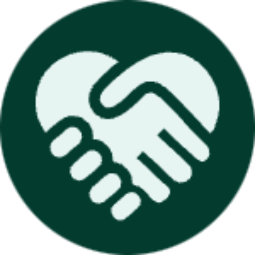

<!--
*** Reference: https://github.com/othneildrew/Best-README-Template/tree/master
-->

<!-- PROJECT LOGO -->
 

  

  <h3 align="center">Lifeline Service</h3>

  

    A redesign project 
     
     
     
    <a href="https://nic-dgl103-f23-cvs2.github.io/project-tp27933/">View Demo</a>
    
  

<!-- ABOUT THE PROJECT -->

## About The Project

[![Product Name Screen Shot][product-screenshot]](https://example.com)

- Redesign a new and simple website for an existing small local business: <a href="http://www.comoxvalleylifeline.com/">http://www.comoxvalleylifeline.com/</a>
- The page layouts are coded mobile-first and adjusted for desktop screens using media queries.

This is a fictional website that was designed and coded as an educational exercise. It is not intended to be seen outside of the class environment. None of the content and images were approved by the business owner.

(<a href="#readme-top">back to top</a>)

### Website of Contents

<!-- Website OF CONTENTS -->
  <ol>
    <li>
     Home Page
      <ul>
        <li>hero</li>
        <li>introduction</li>
        <li>type of services</li>
        <li>how it works</li>
        <li>call-to-action</li>
        <li>subscribe us</li>
        <li>footer</li>
      </ul>
    </li>
    <li>
      About us
      <ul>
       <li>hero</li>
        <li>history of company</li>
        <li>mission and values</li>
          <li>subscribe us</li>
        <li>footer</li>
      </ul>
    </li>
    <li>
    Contact us 
    <ul>
    <li>hero</li>
        <li>map - our location</li>
        <li>contact information</li>
         <li>contact us form </li>
         <li>subscribe us</li>
         <li>footer</li>
      </ul>
    </li>
  </ol>

(<a href="#readme-top">back to top</a>)

### Website Style Guide

- Typography  
  title : Oswald  
  body: Robot
- Colors  
 `primary: #033b2e`
 `neutral: #208c73`
 `highline: #1acda3`

### Built With

- 
- 

(<a href="#readme-top">back to top</a>)

<!-- ACKNOWLEDGMENTS -->

## Acknowledgments

The resources I use for this project and would like to give credit to.

- [ChatGPT](https://flexbox.malven.co/)
- [Unsplash](https://grid.malven.co/)
- [FREEPIK](https://www.freepik.com/)
- [Google Fonts](https://shields.io)
- [Icons8](https://icons8.com/)
- [Font Awesome](https://fontawesome.com)

(<a href="#readme-top">back to top</a>)

## Usage

This is a fictional website that was designed and coded as an educational exercise. It is not intended to be seen outside of the class environment. None of the content and images were approved by the business owner.

<!-- MARKDOWN LINKS & IMAGES -->

[product-screenshot]: assets/screenshot-home.png
